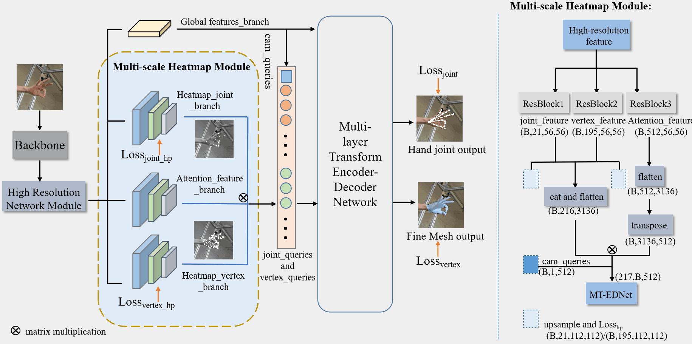

## Overview
Estimating 3D hand pose and recovering the full hand surface mesh from a single RGB image is a challenging task due to self-occlusions, viewpoint changes, and the complexity of hand articulations. In this paper, we propose a novel framework that combines an attention mechanism with heatmap regression to accurately and efficiently predict 3D joint locations and reconstruct the hand mesh. We adopt a pooling attention module that learns to focus on relevant regions in the input image to extract better features for handling occlusions, while greatly reducing the computational cost. The multi-scale 2D heatmaps provide high-level spatial constraints to guide the 3D vertex predictions. By exploiting the complementary strengths of sparse 2D supervision and dense mesh regression, our method accurately reconstructs hand meshes with realistic details. To demonstrate the efficacy of our method, we construct a simple game scene to test the effectiveness and efficiency of our algorithm. Extensive experiments on standard benchmarks demonstrate that the proposed method efficiently improves the performance of 3D hand pose estimation and mesh recover.



---

## Installation
We provide the way to install conda environments depending on CUDA versions. 

Please check [Installation.md](./docs/Installation.md) for more information.

---

## Download
We provide guidelines to download  datasets. 

Please check [Download.md](./docs/Download.md) for more information.

<a name="model_checkpoint"></a>


## Demo
We provide guidelines to run inference on test images.

```bash
python  /src/tools/end_hmesh.py  --resume_checkpoint 
       
```
The checkpoint path ./out_save_epoch_train

---

## Experiments
We provide guidelines to train and evaluate our model on  FreiHAND. 

```bash
python  ./src/tools/run_point_jointmesh.py
       
```

```bash
python  ./src/tools/run_point_jointmesh.py --resume_checkpoint --run_evaluation='True'
       
```
---

## Acknowledgments

Our repository is modified and adapted from these amazing repositories. If you find their work useful for your research, please also consider citing them:
- [METRO](https://github.com/microsoft/MeshTransformer)          
- [FastMETRO](https://github.com/postech-ami/FastMETRO)
- [DETR](https://github.com/facebookresearch/detr)
- [CoFormer](https://github.com/jhcho99/CoFormer)
- [POTTER](https://github.com/zczcwh/POTTER)

